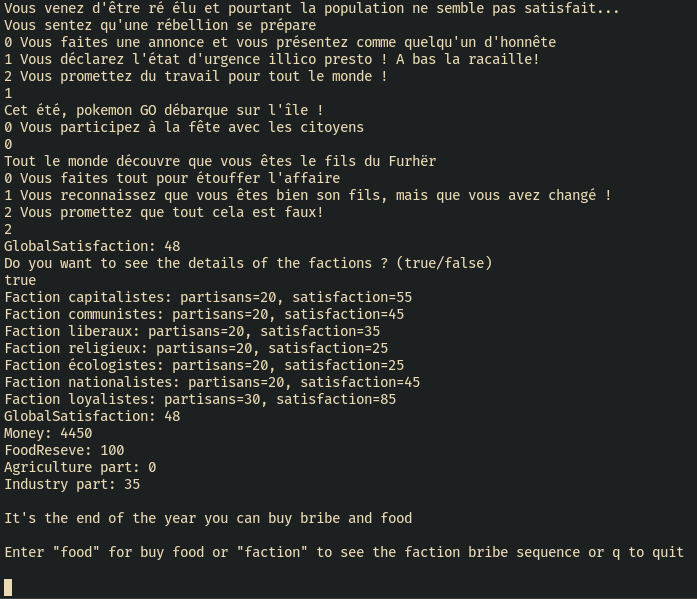
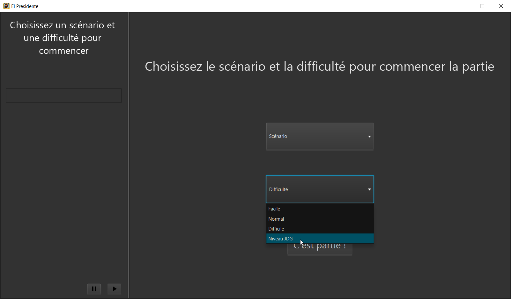
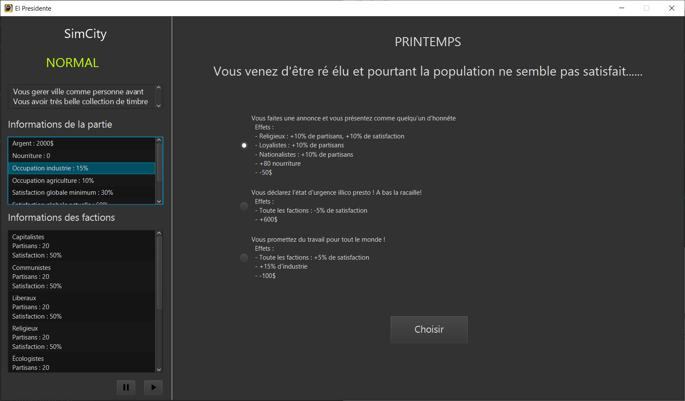
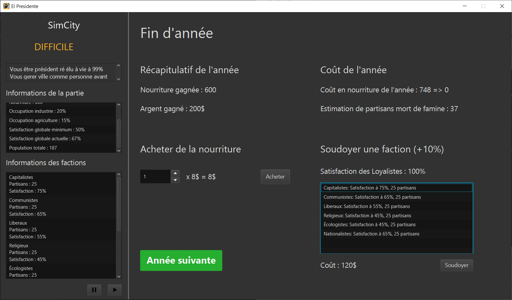
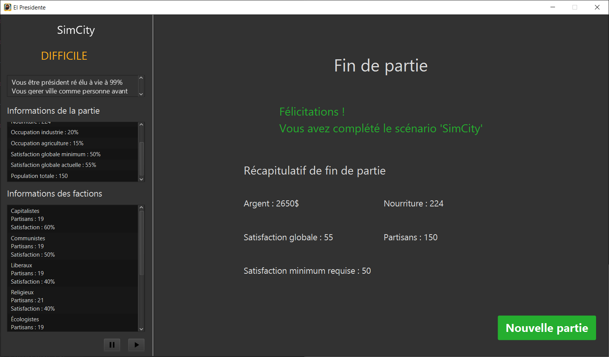
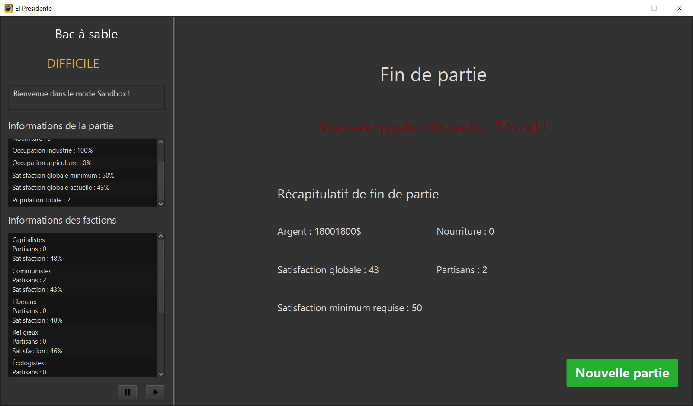

# El Presidente

| Main status                                                  | Dev status                                                   |
| ------------------------------------------------------------ | ------------------------------------------------------------ |
|   |   |
|  |  |

El Presidente is a Tropico / Reigns game like where you are a dictator on a island.

# Links

# Installation

In both case, once you download / generate the jar file, the executable is standalone and you only need to have **Java 11** installed.

## Use release

Download the latest release of the game at : https://github.com/Nouuu/el-presidente/releases

## Build from code

To build from code, maven 3 is needed.

Simply run `mvn install` at the root of the project to generate the latest jar file.

It will be create a jar file named `el_presidente-VERSION.jar` and `el_presidente_VERSION_standalone.jar` at ***/root/folder/target/***

> :warning: You have to use the **standalone** version if the environment don't have javafx or fasterxml installed.

# Usage
to use the app in GUI mode run the .jar by double-click or with command line

If you wan't to run the app in cli mode run the .jar by cli with the option --cli
`java -jar el_presidente_1.0.jar --cli`

## CLI

## JavaFX

Once you have started the app in GUI mode, a javaFX window will show up and ask you the first thing to do : Choose the difficulty and the scenario.

> Try to select **Niveau JDG** for more fun :wink:

Then the game begin !

You can see on the sidebar real-time informations about the chosen scenario, the difficulty, the resources and faction state.

It also show the minimum satisfaction you have to keep at the end of the year or you will loose.

On the right side, an event is displayed with choice to do. Each choice have consequences so be careful !

At the end of the year, depending of the agriculture and industry occupation, you will earn money and food to help you with the next year.

It is the time where you can buy some extra food to avoid famine and bribe some faction to help being above minimum satisfaction. 

When you go on next year, you have three case :

- You didn't loose so the scenario continue
- You didn't loose but the scenario is ended (AKA you win)

- You loose because of your satisfaction.

# [Latest version](https://github.com/Nouuu/el-presidente/releases/tag/1.0)

## Changelog
### [1.0.0] - 2021-02-23
#### Added
- launch of the project in its initial version

### [1.1.0] - 2021-03-02
#### Added
- Easter egg in hardcode
- Refacto of all JavaFX package for better readable 
- Add Play/Pause music button
- Fix scenario details not showing if long text
- Add app icon

### [1.2.0] - 2021-03-06

#### Added

- CLI option to choice Difficulty and Scenario 
- Add a lot of tests for better coverage

# Code

## Dependencies
This project use :
- Maven
- jackson
- JavaFX

For the tests we use the following libraries :
- cucumber
- assertj
- Junit
## Core

### Events

### Factions

### Game

### Helper

### Ressources

### Scenario

### Seasons

## CLI
The CLI is considered to be the development mode.
The CLI is java vanilla, we didn't want to add a library for this part.

### Output
The CLI is not very verbose on the possible options for event of end of year actions
At the end of the year you get optional reports with the Ressources info and the Factions info

### Input
The CLI is based on **Scanner** You must write exactly what is expected

## JavaFX

### FxApp

### FxController

### FxGameManager

### FxMusic

### FxMusicList

# Contributions

|                                                  |                                                              |
| ------------------------------------------------ | ------------------------------------------------------------ |
| [Noé LARRIEU-LACOSTE](https://github.com/Nouuu)  | ) |
| [Swann HERRERA](https://github.com/SwannHERRERA) |  |
