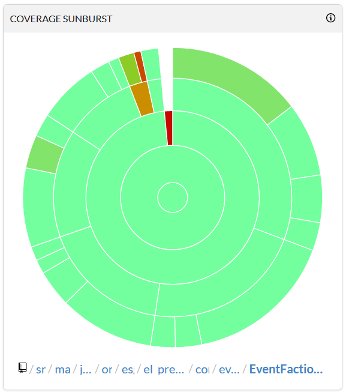

# [El Presidente](https://github.com/Nouuu/el-presidente)

| Main status                                                  | Dev status                                                   |
| ------------------------------------------------------------ | ------------------------------------------------------------ |
|  |  |
| [](https://github.com/Nouuu/el-presidente/actions/workflows/maven.yml) [](https://app.codecov.io/gh/Nouuu/el-presidente/branch/main/) | [](https://github.com/Nouuu/el-presidente/actions/workflows/main.yml) [](https://app.codecov.io/gh/Nouuu/el-presidente/branch/dev/) |
|  |  |

El Presidente is a Tropico / Reigns game like where you are a dictator on a island.

# Links

Project syllabus : [SyllabusDuProjet.pdf](SyllabusDuProjet.pdf) 

JavaFX for java 11 and above : https://openjfx.io/

How to parse Json file in Java : https://www.baeldung.com/jackson-object-mapper-tutorial

Refactoring : https://refactoring.guru/fr

# Installation

In both case, once you download / generate the jar file, the executable is standalone and you only need to have **Java 11** installed.

## Use release

Download the latest release of the game at : https://github.com/Nouuu/el-presidente/releases

## Build from code

To build from code, maven 3 is needed.

Simply run `mvn install` at the root of the project to generate the latest jar file.

It will be create a jar file named `el_presidente-VERSION.jar` and `el_presidente_VERSION_standalone.jar` at ***/root/folder/target/***

> :warning: You have to use the **standalone** version if the environment don't have javafx or fasterxml installed.

# Usage
to use the app in GUI mode run the .jar by double-click or with command line

If you wan't to run the app in cli mode run the .jar by cli with the option --cli
`java -jar el_presidente_1.0.jar --cli`

## CLI


## JavaFX

Once you have started the app in GUI mode, a javaFX window will show up and ask you the first thing to do : Choose the difficulty and the scenario.

> Try to select **Niveau JDG** for more fun :wink:


Then the game begin !

You can see on the sidebar real-time informations about the chosen scenario, the difficulty, the resources and faction state.

It also show the minimum satisfaction you have to keep at the end of the year or you will loose.

On the right side, an event is displayed with choice to do. Each choice have consequences so be careful !


At the end of the year, depending of the agriculture and industry occupation, you will earn money and food to help you with the next year.

It is the time where you can buy some extra food to avoid famine and bribe some faction to help being above minimum satisfaction. 


When you go on next year, you have three case :

- You didn't loose so the scenario continue
- You didn't loose but the scenario is ended (AKA you win)


- You loose because of your satisfaction.


# [Latest version](https://github.com/Nouuu/el-presidente/releases/tag/1.0)

## Changelog
### [1.0.0] - 2021-02-23
#### Added
- launch of the project in its initial version

### [1.1.0] - 2021-03-02
#### Added
- Easter egg in hardcode
- Refacto of all JavaFX package for better readable 
- Add Play/Pause music button
- Fix scenario details not showing if long text
- Add app icon

### [1.2.0] - 2021-03-06

#### Added

- CLI option to choice Difficulty and Scenario 
- Add a lot of tests for better coverage

# Code

## Dependencies

This project use Maven 3.

| Maven dependencies | Version | Description                                                |
| ------------------ | ------- | ---------------------------------------------------------- |
| Junit              | 4.13.1  | Used for unit testing                                      |
| Cucumber           | 6.9.0   | Used for unit testing                                      |
| AssertJ            | 3.18.1  | Used for unit testing                                      |
| JavaFX             | 15.0.1  | Used for GUI app                                           |
| Apache Commons     | 3.11    | Useful libraries functions                                 |
| Jackson            | 2.12.1  | Help to parse JSON file into Java object                   |
| Jacoco plugin      | 0.8.6   | Generate code coverage report from unit tests              |
| Maven shade plugin | 3.2.4   | Compile code with dependencies to make standalone jar file |
| JavaFX plugin      | 0.0.5   | Add configuration to assign main class on launch           |

## Github Actions

### Workflows

We currently added two workflows on our project.

One is triggered when pushing or making a pull request on **dev** branch, the other works on the same way on **main** branch.

```yaml
name: Build & Test Dev

on:
  push:
    branches: [ dev ]
  pull_request:
    branches: [ dev ]
```
```yaml
name: Build & Test Main

on:
  push:
    branches: [ main ]
  pull_request:
    branches: [ main ]
```

Those two workflow do the same thing : build, test and report test coverage.

### Build and test

Once the workflow is triggered, it will :

- Pull the project on the right branch
- Setup JDK 11 on Windows platform
- Search for maven cache from precedent build
- Retrieve missing maven packages
- Run the command `mvn verify` which will build and run unit tests
- Upload Jacoco report on Codecov

```yaml
jobs:
  build:

    runs-on: windows-latest

    steps:
      - name: Pull project
        uses: actions/checkout@v2
      - name: Set up JDK 11
        uses: actions/setup-java@v1
        with:
          java-version: 11
        
      - name: Cache Maven packages
        uses: actions/cache@v2
        with:
          path: ~/.m2
          key: ${{ runner.os }}-m2-${{ hashFiles('**/pom.xml') }}
          restore-keys: ${{ runner.os }}-m2
          
      - name: Build with Maven
        run: mvn --batch-mode --update-snapshots verify
        
      - name: Upload test coverage report on Codecov
        uses: codecov/codecov-action@v1
        with:
          token: ${{ secrets.CODECOV_TOKEN }}
          files: target/site/jacoco/jacoco.xml
```

This will generate a badge that indicate if build and tests were successful : [](https://github.com/Nouuu/el-presidente/actions/workflows/main.yml)

### Codecov

When test coverage report is uploaded on codecov, it analyze our code coverage and generate badge and chart we can analyze to see our efficient is our code coverage :

[](https://app.codecov.io/gh/Nouuu/el-presidente/branch/dev/)

|                                                              |                                                              |
| ------------------------------------------------------------ | ------------------------------------------------------------ |
|  |  |

We can see on each file if each line has been covered, which is just a indicator and not the assurance that our unit test are fine but still very helpful !


There is a config file `codecov.yml` that do some check on pull request and push and determine if our code coverage is conform.

It is set to minimum 90% of code coverage with a maximum of 5% variation of coverage between two push

```yaml
codecov:
  require_ci_to_pass: yes

coverage:
  precision: 2
  round: down
  range: "70...100"
  status:
    project:
      default:
        # basic
        target: 90%
        threshold: 5%
        base: auto 
        flags: 
          - unit
        paths: 
          - "src"
       # advanced settings
        branches:
          - main
          - dev
        if_ci_failed: error #success, failure, error, ignore
        informational: false
        only_pulls: false
    patch:
      default:
        # basic
        target: 90%
        threshold: 5%
        base: auto 
        flags: 
          - unit
        paths: 
          - "src"
       # advanced settings
        branches:
          - main
          - dev
        if_ci_failed: error #success, failure, error, ignore
        informational: false
        only_pulls: false

parsers:
  gcov:
    branch_detection:
      conditional: yes
      loop: yes
      method: no
      macro: no

comment:
  layout: "reach,diff,flags,files,footer"
  behavior: default
  require_changes: no
```

## Unit tests

Testing is a central point of the project we have tested the whole Core part of the project. 

We didn't test the CLI and GUI parts because it's the presentation and we consider that it's bound to evolve too often, there's also a time issue that came into the equation.
We preferred to refocus the tests on the logic of the game. 

- Classic unit test (Junit + AssertJ)
We used 2 patterns for the tests :
- Gerhkin [cucumber](https://cucumber.io/)

In summary the gerhkin tests use a Given When Then structure to enter the tests readable for the non-technical part of the team they also ensure a good separation in the test code.

```
  Scenario: test food price
    Given a game with test scenario in easy
    When i get food price
    Then the food price should be 8
```

We use [Jacoco](https://www.jacoco.org/jacoco/) and [codcov](https://about.codecov.io/) to follow our progress on the tests

## Core

### Events

An event is  is something that happens, it choice choices of el-president and these choices will have consequences that can be negative or positive.

An event can have 1 choice (so no choice in fact) to 4 choices.

The events must be able to influence all the parameters of the game (satisfaction of factions, global satisfaction, the money, industry, agriculture or the number of partisans).

#### Description of an event and JSON

```java
private final Season season;
private final String eventDetails;
private final List<EventChoice> eventChoices;
```

To build our events we use JSON files that describe the details of the event and the possible choices (EventChoice) as well as the impacts it have.

The event choice  have potentially implications on several factions (EventFactionEffect)

```json
{
  "eventDetails": "Un parseur de fichier fait apparition dans le programme.\nCelui-ci est capable de transformer un fichier json en véritable objet java\n",
  "eventChoices": [
    {
      "choiceName": "Tu saute par dessus bord",
      "industryEffect": 7,
      "agricultureEffect": -5,
      "foodEffect": 8,
      "financeEffect": 600,
      "factionEffects": [
        {
          "factionType": "",
          "partisansPercentEffect": 1,
          "satisfactionEffect": -2
        },
      ]
    },
    {
      "choiceName": "Tu reste dans le bato",
      "financeEffect": 60,
      "factionEffects": [
        {
          "factionType": "religieux",
          "partisansPercentEffect": 1,
          "satisfactionEffect": 1
        }
      ]
    }
  ]
}
```

Events are managed by the EventManager


### Factions

### Game

### Helper

### Resources

### Scenario

### Seasons

One season corresponds to one round of the game

The season is linked to an event because all season have an event

Seasons is represented by an enum, which lists the 4 seasons of a year, we use it for loop over it in a year

```java
public enum Season {
    spring("printemps"),
    summer("été"),
    autumn("automne"),
    winter("hiver");

    private final String season;

    Season(String season) {
        this.season = season;
    }

    @Override
    public String toString() {
        return season;
    }

    @JsonCreator
    public static Season fromString(String string) {
        return Arrays.stream(Season.values()).filter(o ->
            o.season                    	  
            .equalsIgnoreCase(string))
            .findFirst().orElse(null);
    }
}
```

## CLI
The CLI is considered to be the development mode.
The CLI is java vanilla, we didn't want to add a library for this part.

### Output
The CLI is not very verbose on the possible options for event of end of year actions
At the end of the year you get optional reports with the Ressources info and the Factions info

### Input
The CLI is based on **Scanner** You must write exactly what is expected

## JavaFX

### SceneBuilder

### FxApp

### FxController

### FxGameManager

### FxMusic

#### FxMusicList

# Contributions

|                                                  |                                                              |
| ------------------------------------------------ | ------------------------------------------------------------ |
| [Noé LARRIEU-LACOSTE](https://github.com/Nouuu)  | []((https://github.com/Nouuu)) |
| [Swann HERRERA](https://github.com/SwannHERRERA) | [](https://github.com/SwannHERRERA) |
